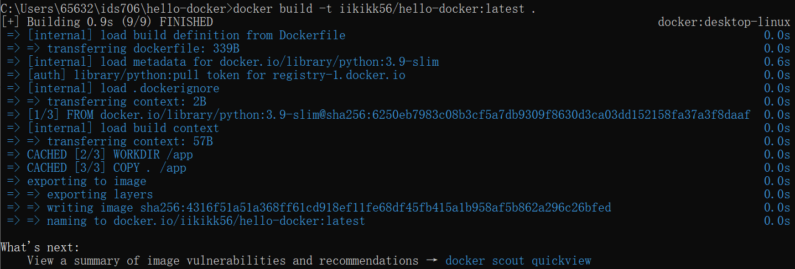
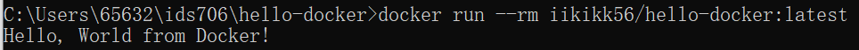
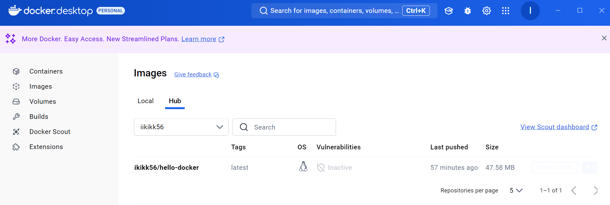

# **Hello Docker**

A simple Python application containerized using Docker. This project demonstrates how to:

- Run a Python application inside a Docker container.
- Build and push a Docker image to Docker Hub using a CI/CD pipeline with GitHub Actions.


## **Project Overview**

This project contains a simple Python script that prints "Hello, World from Docker!" to the console. The application is containerized using Docker, allowing it to run consistently across different environments.

The project also includes a CI/CD pipeline configured with GitHub Actions to automate the building and pushing of the Docker image to Docker Hub whenever changes are pushed to the `main` branch.

---

## **Installation**

### **Clone the Repository**

```bash
git clone https://github.com/your_github_username/hello-docker.git
cd hello-docker
```

---

## **Usage**

### **Running Locally**

You can run the Python script directly on your local machine:

```bash
python app.py
```

**Output:**

```
Hello, World from Docker!
```

### **Using Docker**

#### **Build the Docker Image Locally**

```bash
docker build -t your_dockerhub_username/hello-docker:latest .
```

#### **Run the Docker Container**

```bash
docker run --rm your_dockerhub_username/hello-docker:latest
```

**Output:**

```
Hello, World from Docker!
```

#### **Pull and Run the Docker Image from Docker Hub**

Alternatively, you can pull the image from Docker Hub:

```bash
docker pull your_dockerhub_username/hello-docker:latest
docker run --rm your_dockerhub_username/hello-docker:latest
```

---

## **CI/CD Pipeline**

[](https://github.com/iikikk/hello-docker/actions/workflows/docker-image.yml)


The project uses GitHub Actions for continuous integration and continuous deployment. The workflow is defined in `.github/workflows/docker-image.yml`.

### **Workflow Overview**

- **Trigger:** The workflow runs on every push to the `main` branch.
- **Jobs:**
  - **Checkout Code:** Uses `actions/checkout` to pull the repository code.
  - **Log in to Docker Hub:** Authenticates with Docker Hub using credentials stored in GitHub Secrets.
  - **Build and Push Docker Image:** Builds the Docker image and pushes it to Docker Hub.

### **Setting Up GitHub Secrets**

To enable the CI/CD pipeline, you need to add your Docker Hub credentials as secrets in your GitHub repository:

1. Go to your repository on GitHub.
2. Click on **Settings** > **Secrets and variables** > **Actions**.
3. Click **New repository secret**.
4. Add the following secrets:

   - **DOCKERHUB_USERNAME**: Your Docker Hub username.
   - **DOCKERHUB_TOKEN**: Your Docker Hub access token (generate one from Docker Hub Account Settings > Security > Access Tokens).

### Screenshot



